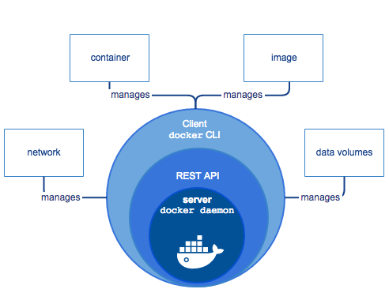

# Docker

Docker is a platform for developers and sysadmins to develop, deploy, and run applications with containers. 

The use of Linux containers to deploy applications is called containerization. 

Containers are not new, but their use for easily deploying applications is.

Containerization is increasingly popular because containers are:

- Flexible: Even the most complex applications can be containerized.
- Lightweight: Containers leverage and share the host kernel.
- Interchangeable: You can deploy updates and upgrades on-the-fly.
- Portable: You can build locally, deploy to the cloud, and run anywhere.
- Scalable: You can increase and automatically distribute container replicas.
- Stackable: You can stack services vertically and on-the-fly.

## Docker Uses

- Your developers write code locally and share their work with their colleagues using Docker containers.
- They use Docker to push their applications into a test environment and execute automated and manual tests.
- When developers find bugs, they can fix them in the development environment and redeploy them to the test environment for testing and validation.
- When testing is complete, getting the fix to the customer is as simple as pushing the updated image to the production environment.

## Docker Engine



Docker Engine is a client-server application with these major components:

- A server which is a type of long-running program called a daemon process (the `dockerd` command).
- A REST API which specifies interfaces that programs can use to talk to the daemon and instruct it what to do.
- A command line interface (CLI) client (the docker command).

## Docker Architecture


Docker uses a client-server architecture. The Docker client talks to the Docker daemon, which does the heavy lifting of building, running, and distributing your Docker containers. The Docker client and daemon can run on the same system, or you can connect a Docker client to a remote Docker daemon. The Docker client and daemon communicate using a REST API, over UNIX sockets or a network interface.

### The Docker daemon

The Docker daemon (`dockerd`) listens for Docker API requests and manages Docker objects such as images, containers, networks, and volumes. A daemon can also communicate with other daemons to manage Docker services.

### The Docker client

The Docker client (`docker`) is the primary way that many Docker users interact with Docker. When you use commands such as docker run, the client sends these commands to `dockerd`, which carries them out. The docker command uses the Docker API. The Docker client can communicate with more than one daemon.

### Docker registries

A Docker registry stores Docker images. Docker Hub is a public registry that anyone can use, and Docker is configured to look for images on Docker Hub by default. You can even run your own private registry. If you use Docker Datacenter (DDC), it includes Docker Trusted Registry (DTR).
When you use the docker pull or docker run commands, the required images are pulled from your configured registry. When you use the docker push command, your image is pushed to your configured registry.

### Docker objects

When you use Docker, you are creating and using images, containers, networks, volumes, plugins, and other objects. This section is a brief overview of some of those objects.

### Images and Container

A container is launched by running an `image`. 

An `image` is an executable package that includes everything needed to run an application--the code, a runtime, libraries, environment variables, and configuration files.

A `container` is a runtime instance of an image--what the image becomes in memory when executed (that is, an image with state, or a user process). You can see a list of your running containers with the command, `docker ps`, just as you would in Linux.

## Container Vs. Virtual Machines


A container runs natively on Linux and shares the kernel of the host machine with other containers. It runs a discrete process, taking no more memory than any other executable, making it lightweight.

By contrast, a virtual machine (VM) runs a full-blown “guest” operating system with virtual access to host resources through a hypervisor. In general, VMs provide an environment with more resources than most applications need.

## `Dockerfile`

`Dockerfile` helps defining a container.

### Python App Example

In the past, if you were to start writing a Python app, your first order of business was to install a Python runtime onto your machine. But, that creates a situation where the environment on your machine needs to be perfect for your app to run as expected, and also needs to match your production environment.

With Docker, you can just grab a portable Python runtime as an image, no installation necessary. Then, your build can include the base Python image right alongside your app code, ensuring that your app, its dependencies, and the runtime, all travel together.

These portable images are defined by something called a `Dockerfile`.

`Dockerfile` defines what goes on in the environment inside your container. Access to resources like networking interfaces and disk drives is virtualized inside this environment, which is isolated from the rest of your system, so you need to map ports to the outside world, and be specific about what files you want to “copy in” to that environment. 

```dockerfile
# Use an official Python runtime as a parent image
FROM python:3.7-slim

# Set the working directory to /app
WORKDIR /app

# Copy the current directory contents into the container at /app
COPY . /app

# Install any needed packages specified in requirements.txt
RUN pip install --trusted-host pypi.python.org -r requirements.txt

# Make port 80 available to the world outside this container
EXPOSE 80

# Define environment variable
ENV NAME World

# Run app.py when the container launches
CMD ["python", "app.py"]
```

### Docker Command

```bash
docker build -t friendlyhello .  # Create image using this directory's Dockerfile
docker run -p 4000:80 friendlyhello  # Run "friendlyhello" mapping port 4000 to 80
docker run -d -p 4000:80 friendlyhello         # Same thing, but in detached mode
docker container ls                                # List all running containers
docker container ls -a             # List all containers, even those not running
docker container stop <hash>           # Gracefully stop the specified container
docker container kill <hash>         # Force shutdown of the specified container
docker container rm <hash>        # Remove specified container from this machine
docker container rm $(docker container ls -a -q)         # Remove all containers
docker image ls -a                             # List all images on this machine
docker image rm <image id>            # Remove specified image from this machine
docker image rm $(docker image ls -a -q)   # Remove all images from this machine
docker login             # Log in this CLI session using your Docker credentials
docker tag <image> username/repository:tag  # Tag <image> for upload to registry
docker push username/repository:tag            # Upload tagged image to registry
docker run username/repository:tag                   # Run image from a registry
```

## Services

Services are really just “containers in production.” A service only runs one image, but it codifies the way that image runs—what ports it should use, how many replicas of the container should run so the service has the capacity it needs, and so on.

Luckily it’s very easy to define, run, and scale services with the Docker platform -- just write a `docker-compose.yml` file.

## Docker Compose

Compose is a tool for defining and running multi-container Docker applications. With Compose, you use a YAML file to configure your application’s services. Then, with a single command, you create and start all the services from your configuration.

Using Compose is basically a three-step process:

- Define your app’s environment with a `Dockerfile` so it can be reproduced anywhere.
- Define the services that make up your app in `docker-compose.yml` so they can be run together in an isolated environment.
- Run `docker-compose up` and Compose starts and runs your entire app.

A sample `docker-compose.yml` file:

```yaml
version: "3"
services:
  web:
    # replace username/repo:tag with your name and image details
    image: username/repo:tag
    deploy:
      replicas: 5
      resources:
        limits:
          cpus: "0.1"
          memory: 50M
      restart_policy:
        condition: on-failure
    ports:
      - "4000:80"
    networks:
      - webnet
```

This `docker-compose.yml` file tells Docker to do the following:

- Pull the image  from the registry.
- Run 5 instances of that image as a service called web, limiting each one to use, at most, 10% of a single core of CPU time (this could also be e.g. “1.5” to mean 1 and half core for each), and 50MB of RAM.
- Immediately restart containers if one fails.
- Map port 4000 on the host to web’s port 80.
- Instruct web’s containers to share port 80 via a load-balanced network called webnet. (Internally, the containers themselves publish to web’s port 80 at an ephemeral port.)
- Define the webnet network with the default settings (which is a load-balanced overlay network).

### Exercise:

```bash
# Build a docker container
docker build -f sor-api/deployment/Dockerfile -t sajalshres/sor-api:1.0 sor-api/

# List images
docker images
docker image list

# Push the container to repository
docker push sajalshres/sor-api:1.0

# Pull Images
docker image pull python:3.7
docker pull python:3.7

# Run a image
docker run -p 9990:9990/tcp sajalshres/sor-api:1.0 python manage.py runserver 0:9990
docker run -p 9990:9990/tcp -d sajalshres/sor-api:1.0 python manage.py runserver 0:9990
docker run -it --privileged sajalshres/sor-api:1.0 bash

```

